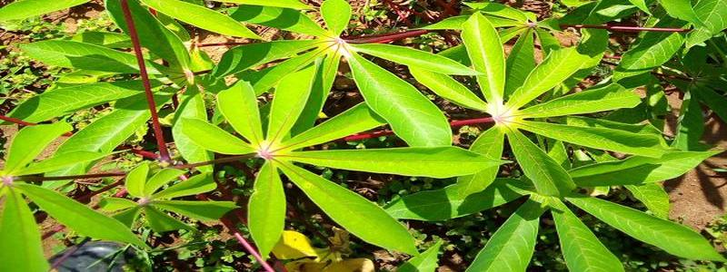
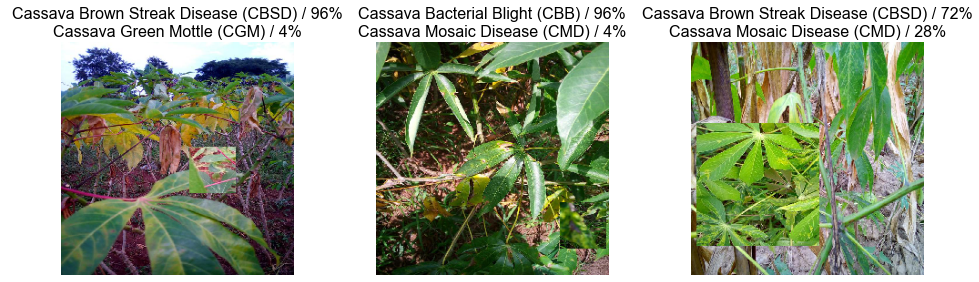
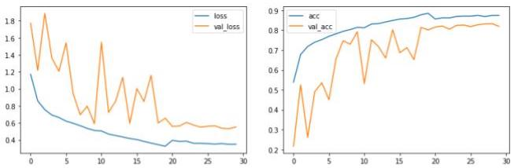
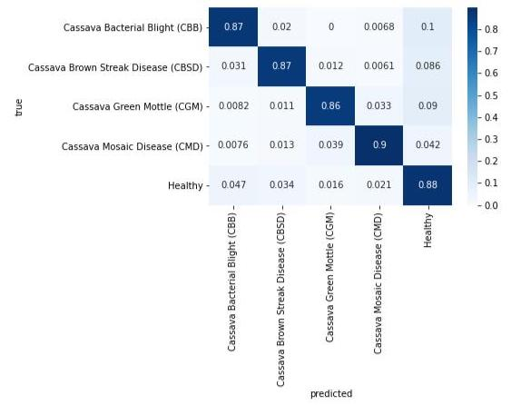
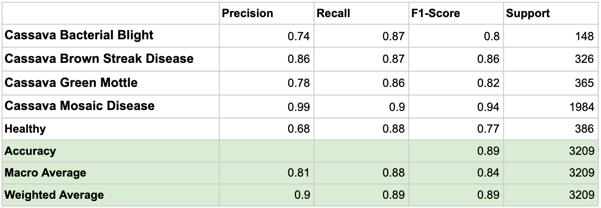
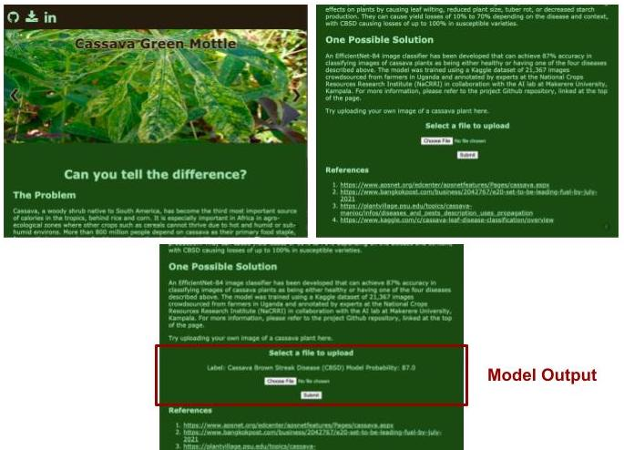

# Cassava Image Classification

## A Life-Giving Crop 
Cassava is a robust crop that can thrive in many challenging climates, including the tropics and sub-Saharan Africa. As such cassava has become the primary food staple for over 800 million people, many of whom live in areas where food insecurity and mal-nutrition is rampant. Unfortunately cassava yields are lower than average in some of the poorest regions that depend on it the most, such as central, eastern, and southern Africa. These losses are largely due to cassava-related diseases, which can have devastating effects on plants by causing leaf wilting, reduced plant size, tuber rot, or decreased starch production. 

## The Problem
Cassava diseases must be addressed promptly by farmers to prevent spread. When a plant does not appear perfectly healthy a farmer faces a difficult choice. She can: 
1. Burn the crop to protect other plants, and suffer the loss of the crop.
2. Keep the crop and risk disease spread, which can cause yield losses of 10% to 70%.

Adding to the dilemma is the difficulty and cost of getting expert feedback on whether or not the plant is truly diseased. The goal of this project was to address this need by developing a web application where farmers could upload images of questionable plants and receive feedback from an image classifier as to whether the plant is healthy or has one of four diseases. 

## Model Architecture and Training
An EfficientNet-B4 model was trained on ~20,000 images of cassava plants. The images were crowd-sourced from farmers in Uganda and annotated by experts at the National Crops Resources Research Institute (NaCRRI) in collaboration with the AI lab at Makerere University, Kampala <a href='ttps://www.kaggle.com/c/cassava-leaf-disease-classification/overview '>[ref]</a>. Images were preprocessed using basic and Cutmix augmentation methods. Please see the capstone report for a full description of the data processing, model architecture and model training.

<figure>
    <figcaption style='text-align:center;'>Cutmix Images</figcaption>
    
</figure>

<figure>
    <figcaption style='text-align:center;'>Model Training</figcaption>
    
</figure>

## Model Evaluation

The resulting model achieved a validation accuracy of 89% and a test accuracy of 87.8% on a hidden test set of 15,000 images. 

<figure>
    <figcaption style='text-align:center;'>Validation Confusion Matrix</figcaption> 
    
</figure>

<figure>
    <figcaption style='text-align:center;'>Model Metrics</figcaption>
    
</figure>

## Flask App Development

A Flask app was developed to demonstrate the potential use of the resulting model. Through the web API a farmer could upload an image of their cassava plant and receive the model classification and probability. To Flask app is stored in the flaskapp directory of the repository. The model is too large to be hosted on Github and can be <a href='https://drive.google.com/file/d/1Kzg0Y6fHNholxjBIzHmTde_L6ujbbOzN/view?usp=sharing'>downloaded from Google Drive here</a>. To run the app locally first download the model h5py file, place it in the repository's models/ directory. Then navigate to the flaskapp directory in the command line and run the following code:

    export FLASK_APP=app.py
    flask run

Then navigate to the URL provided in the command line. 

<figure>
    <figcaption style='text-align:center;'>Website Screenshots</figcaption>
    
</figure>

